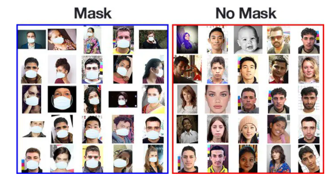

### Capstone project on Face Mask Detection Using OpenCV and Keras

### **Content**
  * **Importing required libraries and frameworks**
  * **Data and preprocessing**
  * **Modeling**
  * **Model training**
  * **Evaluation**
  * **Conclusion**

**Problem Statement**

During this pandemic time, having face mask on is one of the critical requirements in mitigating the spread of COVID19. Having people check/detect whether every visitor to a facility has a mask on  every time and every where while in the facility is costly and not effective. In this project, we’ll deploy a model that will accurately predict whether someone at public gatherings or business centers has face mask on  and sends out a warning alert if no face mask is detected.

**Dataset**: From [Kaggle](https://www.kaggle.com/prithwirajmitra/covid-face-mask-detection-dataset)

* The dataset has both **Train** and **Test** datasets, each having subfolders containing pictures with mask and without mask.  

