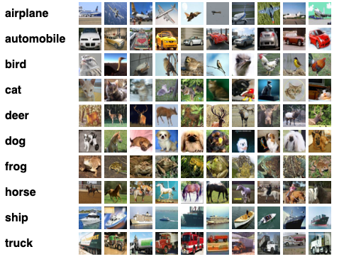

### Capstone project on CIFAR-10 Image Classification

### **Content**
  * **Importing required libraries and frameworks**
  * **Data and preprocessing**
  * **Modeling**
  * **Model training**
  * **Evaluation**
  * **Conclusion**

**Problem Statement** <br>
As human use their eyes to perceive and react to their surrounding, in this digital era computers use `computer vision` field to help us better served from modern technology and also make things much better than ever. Image classification (or image detection) is among the crucial tasks that computers perform to help human in:
- Autonomous driving
- Facial Detection and Recognition
- Detecting COVID-19, Breast Cancer, Skin Cancer etc in Medicine, Biology, and Healthcare sectors
- Mobile computing and accessibility, and so on <br>
This project builds a model that accurately classifies or predicts images from a given dataset based on unique features of training dataset.


**Dataset**: From [keras datasets](https://keras.io/api/datasets/cifar10/) and more details about the images is located on the [keras official website](https://www.cs.toronto.edu/~kriz/cifar.html).

>The `CIFAR-10` dataset consists of `60000` 32x32 color images in 10 classes, with 6000 images per class. There are 50000 training images and 10000 test images. <br>
The dataset is divided into five training batches and one test batch, each with 10000 images. The test batch contains exactly 1000 randomly-selected images from each class. The training batches contain the remaining images in random order, but some training batches may contain more images from one class than another. Between them, the training batches contain exactly 5000 images from each class ([source](https://www.cs.toronto.edu/~kriz/cifar.html)).

I manually split the `50,000` training images into `30,000 images` for training and `20,000 images` for validation of my models and the `10,000 images` are for testing ([refer my jupyter notebook](https://github.com/sthirpa/Data_Scince_Immersive/blob/Hirpa/codes%20in%20JupyterNotebook/CIFAR-10-SH.ipynb)).

```   
CIFAR-10 Dataset
    |-- Train: 30,000 images
    |-- Validation: 20,000 images
    |-- Test: 10,000 images

```  
Sample pictures for each class of the `CIFAR-10` dataset:

<div>

<div>


## Data Dictionary: <br>
Besides [keras official website](https://www.cs.toronto.edu/~kriz/cifar.html), I tried to list some terms in alphabetical order. <br>


## Data Dictionary
|Term|Description|
|---|---|
|Accuracy| a metric that describes the performance of a model and values range from 0-1|
|Batch normalization layer|introduces two trainable parameters which allow the model to scale all the activations of the preceding layer. In practice, this results in a smoother optimization function and therefore reduces the number of epochs required for convergence|
|Computer Vision|is a subfield of Deep Learning and Artificial Intelligence that enables computers to see and interpret the world around them.|
|Convolution||
|Data augmentation|the process of artificially increasing the dataset by introducing slight alterations (rotating and flipping images) to the original data|
|Dropout layer|A dropout layer randomly silences activations of nodes of the preceding layer during training. The number of silenced activations is defined by the dropout rate. A dropout rate of 0 and 1 corresponds to zero or all nodes being silenced, respectively. Dropout layers can help to avoid overfitting|
|Edge detection|is the task of detecting boundaries in images|
|Epochs|Number of iterations, the model is trained. In each training iteration, the parameters of the neural net are updated|
|Image segmentation|is the division of an image into subparts or sub-objects to demonstrate that the machine can discern an object from the background and/or another object in the same image [see segment].|
|Learning rate|The learning rate defines how much model parameters are changed in each training iteration|
|Non-Linear Activations|introduce non-linearity to the neural network, thereby allowing the stacking of multiple convolutions and pooling blocks to increase model depth.|
|Normalization|transforming the input datasets into a relatively small range, in this case to 0 to 1 range |
|Overfitting|After training, models should typically be employed to predict new data. If a model is trained well, it is capable to perform well on such unseen data. On the other hand, an overfit model will only be able to correctly predict the exact same data it was trained on. Methods to prevent overfitting are often called "regularization methods" ([source](https://github.com/maikherbig/AIDeveloper/tree/master/Terminology))|
|pixel|the smallest quanta in which the image can be divided into.All pixels come together to form a digital image.|
|Pooling|is an operation used to reduce the dimensions of an image by performing operations at a pixel level. A pooling kernel slides across the image, and only one pixel from the corresponding pixel group is selected for further processing, thus reducing the image size., eg., Max Pooling, Average Pooling([source](https://www.v7labs.com/blog/what-is-computer-vision)).|
|Segment|A “segment” of an image represents a particular class of object that the neural network has identified in an image, represented by a pixel mask that can be used to extract it.[see `edge detection`]|
|Testing dataset|After the model is built, testing data once again validates that it can make accurate predictions. If training and validation data include labels to monitor performance metrics of the model, the testing data should be unlabeled. Test data provides a final, real-world check of an unseen dataset to confirm that the ML algorithm was trained effectively.[Refer validation dataset, below]|
|Training dataset|Training of deep neural nets is performed based on an existing labelled dataset, called training dataset ("supervised machine learning")|
|Validation dataset|During training, validation data infuses new data into the model that it hasn’t evaluated before. Validation data provides the first test against unseen data, allowing data scientists to evaluate how well the model makes predictions based on the new data. Not all data scientists use validation data, but it can provide some helpful information to optimize hyperparameters, which influence how the model assesses data ([source](https://www.applause.com/blog/training-data-validation-data-vs-test-data)).|

## References:
- E.Mohammed, Deep Learning for Vision Systems, Manning Publications Co, 2020.
- I. Goodfellow, Y. Bengio, A. Courville, Deep Learning, MIT Press, 2016.
- T. Fawcett, Pattern Recognit. Lett. 2006, 27, 861.
