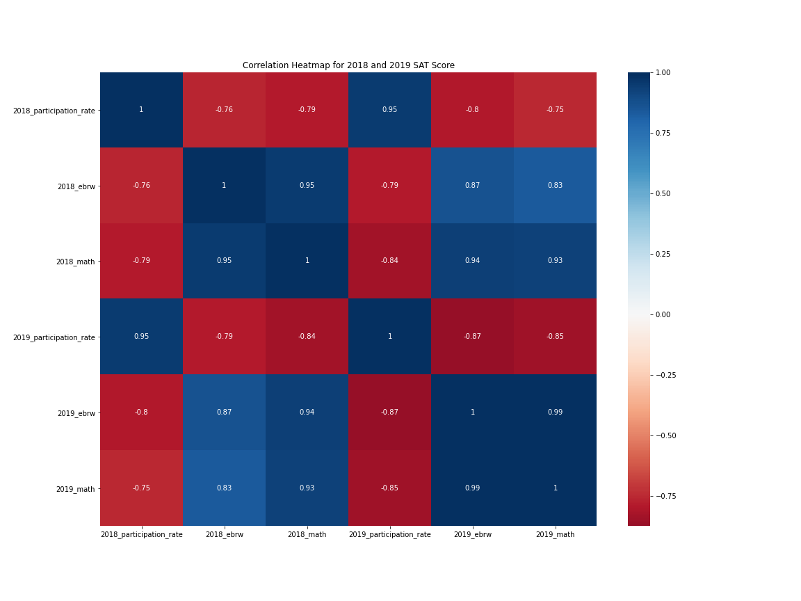

## Problem Statement

Analyzing SAT test scores from the years 2018 and 2019, this project will show students’ performance on the tests and the correlations among the tests and participation rates of all the US states.


### Contents:
- [Background](#Background)
- **Part 1:** [Data Import & Cleaning](#Data-Import-and-Cleaning)
- **Part 2:** [Exploratory Data Analysis](#Exploratory-Data-Analysis)
- **Part 3:** [Data Visualization](#Visualize-the-Data)
- [Conclusions and Recommendations](#Conclusions-and-Recommendations)


This analysis is made depending on two databases:
 sat_2018.csv: 2018 SAT Scores by State, and
 sat_2019.csv: 2019 SAT Scores by State.


Both datasets contain participation rates, evidence based reading and writing (referred as 'verbal test' sometimes in this project), and maths score columns with their corresponding total test scores.

* Coding challenges exercised that we apply as we dive into the analysis.

```

# Evaluates mean without importing any math module library
lst = [2,3,4,5,6,7]

def mean(lst):
    total = 0
    for num in lst:
        total += int(num)
    return total/len(lst)

mean(lst

  Output:
  4.5

```


```
# Evalutes standard deviation without importing any module
lst = [2,3,4,5,6,7]
def standarddev(lst):
    devlst = []
    for num in lst:
        dev = (num - mean(lst))**2
        devlst.append(dev)
    stdev = (sum(devlst)/len(lst))**0.5
    return stdev
standarddev(lst)

Output:
1.707825127659933

```

```
# Removing unnecessary symbols for numerical evaluations


#function takes string as input
def my_function(number):
    # remove '%' symbol in number
    number = number[:-1]
    # convert into decimal approximation
    # by diving with 100
    percent = (float(number))/100
    # return decimal appropriation
    return percent

# call the function and print output
# change string as per requirement
print(my_function('30.5%'))

Output:
0.305
```

The analysis is done using imported modules:

# Imports:
    import numpy as np

    import seaborn as sns

    import matplotlib.pyplot as plt

    import pandas as pd

    import scipy.stats as stats
Cleaning each dataset from sat_2018.csv and sat_2019.csv, we have merged together for better analysis.

After doing the data cleaning process for each dataset, we merged to make another dataset, named: sat18_19.csv and saved this cleaned data. So, most of the data analysis is done using the DataFrame -  'sat18_19.csv'; where its columns are:

|state|2018_participation_rate|2018_ebrw|2018_math|2019_participation_rate|2019_ebrw|2019_math|
|---|---|---|---|---|---|---|


We have the following **Data dictionary** for terms used in the project.


|Feature|Type|Dataset|Description|
|---|---|---|---|
|**state**| *object*|SAT-HigherEd|States in the US and District of Columbia|
|**2018_participation_rate**|*float64*|SAT-HigherEd|percentage rate among high school seniors in 2018|
|**2018_ebrw**|*int64*|SAT-HigherEd	|The average score of the ***Evidence-Based Reading and Writing*** section in 2018 (out of 800)|
|**2018_math**|*int64*|SAT-HigherEd|The average score of the Mathematics section in 2018 (out of 800)|
|**2018_math**|*int64*|SAT-HigherEd	|The average score of the Mathematics section in 2018 (out of 800)|
|**2018_total**|*int64*|SAT-HigherEd|The average of the total SAT score in 2018 (out of 1600)|
|**2019_participation_rate**|*float64*|SAT-HigherEd|percentage rate among high school seniors in 2019|
|**2019_ebrw**|*int64*|SAT-HigherEd	|The average score of the ***Evidence-Based Reading and Writing*** section in 2018 (out of 800)|
|**2019_math**|*int64*|SAT-HigherEd|The average score of the Mathematics section in 2019 (out of 800)|
|**2019_math**|*int64*|SAT-HigherEd	|The average score of the Mathematics section in 2019 (out of 800)|
|**2019_total**|*int64*|SAT-HigherEd|The average of the total SAT score in 2019 (out of 1600)|

Below are some of the visual graphs used in the project.


image





The merged dataset is saved as sat18_19.csv in the same file folder.

And finally - **Cnclusions/Recommendations**


Based on the analysis, SAT mean score for math is less than the verbal test for both years.
SAT mean participation rate increased by more than 4% in 2019.
SAT score doesn’t reflect participation rate, and vice versa.
This analysis can’t help us infer whether SAT score is the best indication of student  success  after enrolling into a college.
Since SAT requirement for college enrollment is currently suspended for many colleges, further comprehensive analysis needs to be conducted on students' high school performance.
