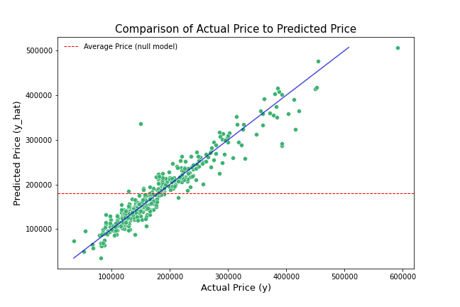
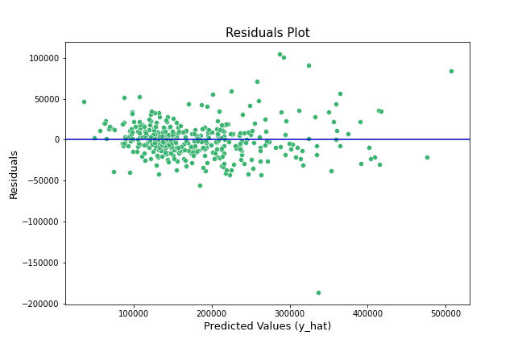

## Project 2: Ames Housing Predictor Model

Author: Sileshi Hirpa

**Contents:**

* Problem Statement
* Executive Summary
* Data Dictionary
* Conclusions and Recommendations

### Problem Statement

Aim: Identifying features that affect housing market

Creating models based on the Ames Housing Dataset which will predict the price of a house at sale in Ames, IA. Although individuals who are interested in selling/buying house can benefit from this, the main target audience for my project will be property agents (real estate industry in Ames) who makes estimation of prices for each property meant to be put on the market in the city.

### Methodology
|Steps|Description|
|---|---|
|1. Obtain Data|Ames Housing Data (2051 homes, each with 81 features)|
|2. Clean Data|Null Values, Data Types, Values within expected range|
|3. EDA|Focus on relationship between features and target (Sale Price)|
|4. Feature Engineering|Informed by EDA|
|5. Model Preparation|Split the dataset into train & Test  where, test size = 20%|
|6. Modeling|Linear Regression, Ridge Regression, LASSO Regression|
|7. Metrics used|Mean squared error and the R2  metrics were used for comparison|

**Data Dictionary**

Full data dictionary for the original Ames dataset [here](http://jse.amstat.org/v19n3/decock/DataDocumentation.txt).

|Feature|Description|
|---|---|
|train.csv|the traning dataset|
|test.csv| the test dataset|
|sample_submission.csv|a benchmark submission from a linear regression on year and month of sale, lot square footage, and number of bedrooms|
|SalePrice|the property's sale price in dollars. This is the target variable that you're trying to predict.|
|MSSubClass|The building class|
|MSZoning|The general zoning classification|
MSZoning|The general zoning classification
LotFrontage|Linear feet of street connected to property
LotArea|Lot size in square feet
Street|Type of road access
Alley|Type of alley access
LotShape|General shape of property
LandContour|Flatness of the property
Utilities|Type of utilities available
LotConfig|Lot configuration
LandSlope|Slope of property
Neighborhood|Physical locations within Ames city limits
Condition1|Proximity to main road or railroad
Condition2|Proximity to main road or railroad (if a second is present)
BldgType|Type of dwelling
HouseStyle|Style of dwelling
OverallQual|Overall material and finish quality
OverallCond|Overall condition rating
YearBuilt|Original construction date
YearRemodAdd|Remodel date
RoofStyle|Type of roof
RoofMatl|Roof material
Exterior1st|Exterior covering on house
Exterior2nd|Exterior covering on house (if more than one material)
MasVnrType|Masonry veneer type
MasVnrArea|Masonry veneer area in square feet
ExterQual|Exterior material quality
ExterCond|Present condition of the material on the exterior
Foundation|Type of foundation
BsmtQual|Height of the basement
BsmtCond|General condition of the basement
BsmtExposure|Walkout or garden level basement walls
BsmtFinType1|Quality of basement finished area
BsmtFinSF1|Type 1 finished square feet
BsmtFinType2|Quality of second finished area (if present)
BsmtFinSF2|Type 2 finished square feet
BsmtUnfSF|Unfinished square feet of basement area
TotalBsmtSF|Total square feet of basement area
Heating|Type of heating
HeatingQC|Heating quality and condition
CentralAir|Central air conditioning
Electrical|Electrical system
1stFlrSF|First Floor square feet
2ndFlrSF|Second floor square feet
LowQualFinSF|Low quality finished square feet (all floors)
GrLivArea|Above grade (ground) living area square feet
BsmtFullBath|Basement full bathrooms
BsmtHalfBath|Basement half bathrooms
FullBath|Full bathrooms above grade
HalfBath|Half baths above grade
Bedroom|Number of bedrooms above basement level
Kitchen|Number of kitchens
KitchenQual|Kitchen quality
TotRmsAbvGrd|Total rooms above grade (does not include bathrooms)
Functional|Home functionality rating
Fireplaces| Number of fireplaces
FireplaceQu| Fireplace quality
GarageType| Garage location
GarageYrBlt| Year garage was built
GarageFinish| Interior finish of the garage
GarageCars| Size of garage in car capacity
GarageArea| Size of garage in square feet
GarageQual| Garage quality
GarageCond| Garage condition
PavedDrive| Paved driveway
WoodDeckSF| Wood deck area in square feet
OpenPorchSF| Open porch area in square feet
EnclosedPorch| Enclosed porch area in square feet
3SsnPorch| Three season porch area in square feet
ScreenPorch| Screen porch area in square feet
PoolArea| Pool area in square feet
PoolQC| Pool quality
Fence|Fence quality
MiscFeature|Miscellaneous feature not covered in other categories
MiscVal|Value of miscellaneous feature
MoSold|Month Sold
YrSold|Year Sold
SaleType|Type of sale
|SaleCondition| Condition of sale|

### Conclusions and Recommendations

* This project is great tool for real estate agents/individuals who’s an interest in the real estate  industry.

* The project shows how each feature can affect sale price of a house in Ames, IA.

* Linear regression model performed better among the three models
* Individuals who wants to sell their homes can focus on improving  worst house features to bring up prices
* While this model generalizes well to the city of Ames, it's probably not generalizable to other cities, since each city/state differ greatly in terms of external factors like geographical features, seasonal weather or the economic climate of that particular city.
* Another point to keep in mind that this model doesn't consider the inflation of housing prices. Since the end of the financial crisis in 2008, housing prices throughout the US have been increasing steadily year over year. Our model would need significant retraining to predict the current house prices in Ames today.

## References
For this project, I used different online sources, cited as follows:
* [Exploratory Data Analysis of Housing in Ames, Iowa](https://www.kaggle.com/leeclemmer/exploratory-data-analysis-of-housing-in-ames-iowa)

* [House Price Prediction - Linear/Lasso/Ridge
Python · House Prices - Advanced Regression Techniques](https://www.kaggle.com/phomolo/house-price-prediction-linear-lasso-ridge)
* [PREDICTING HOUSING PRICES WITH REGRESSION
](http://www.eamonfleming.com/projects/housing-regression.html)
